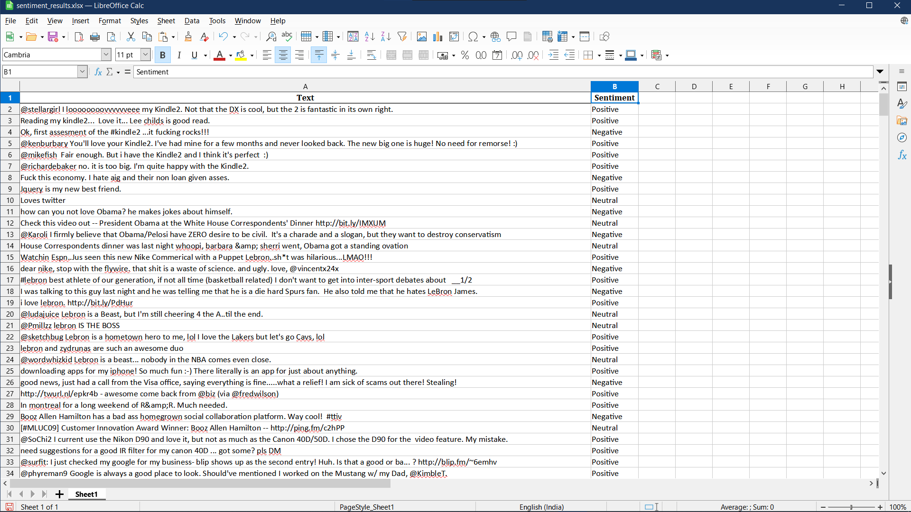
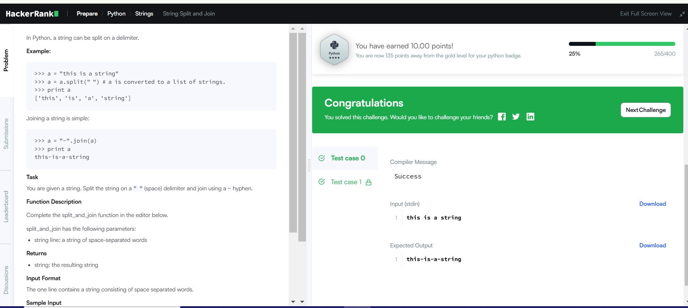
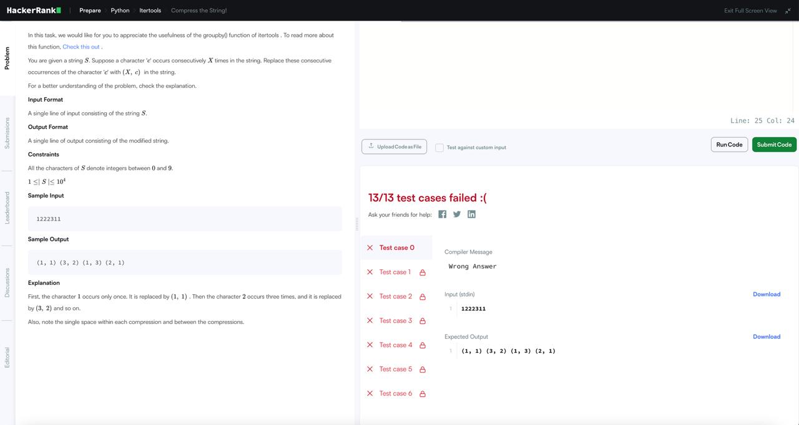
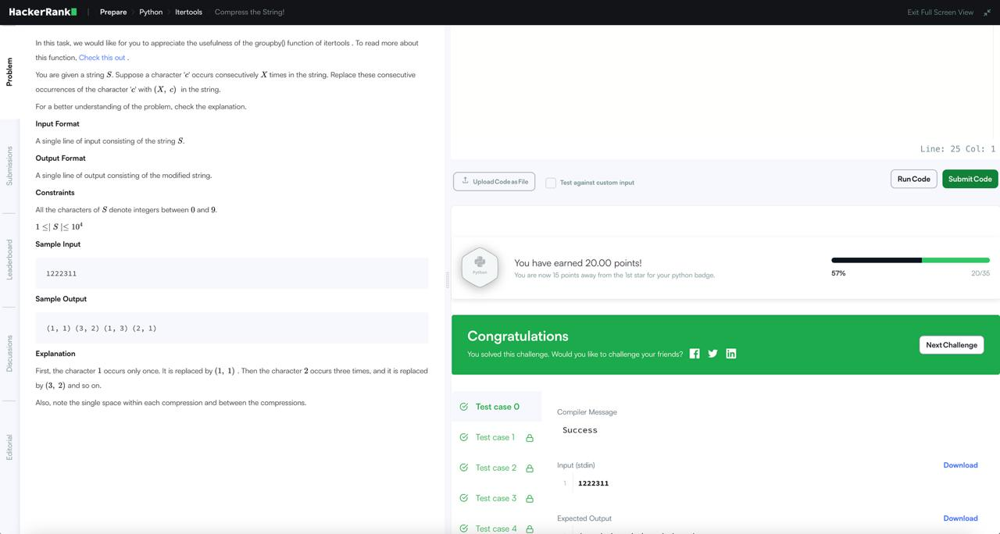
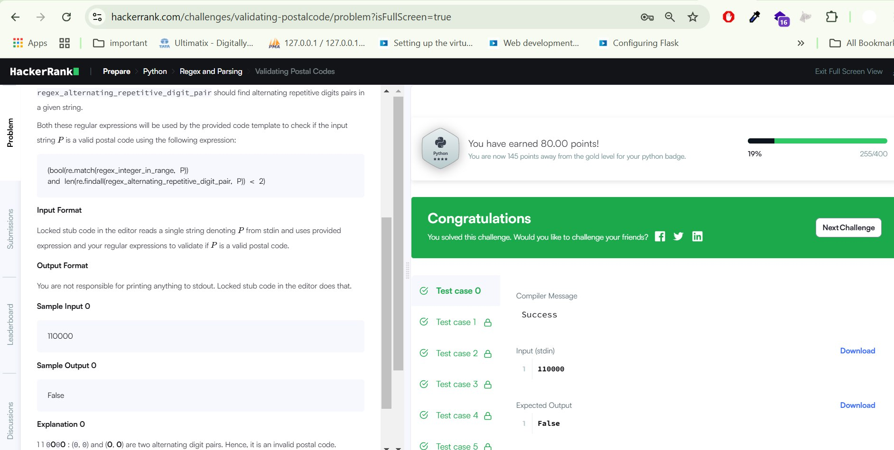

## IN-Class: Programming with LLMs

**Team Puma:** *Aarsh Sheth (TL) || Pooja Sindham || Shivani Jariwala || Aishwarya Indi*

Github Link: [https://github.com/wh0th3h3llam1/cmpe-272](https://github.com/wh0th3h3llam1/cmpe-272)

ChatGPT Link: [https://chatgpt.com/share/67a19a57-1a7c-800a-a0ba-9c19eef5c07f](https://chatgpt.com/share/67a19a57-1a7c-800a-a0ba-9c19eef5c07f)

ChatGPT Prompt:
```
4,3,Mon May 11 03:17:40 UTC 2009,kindle2,tpryan,"@stellargirl I loooooooovvvvvveee my Kindle2. Not that the DX is cool, but the 2 is fantastic in its own right." 4,4,Mon May 11 03:18:03 UTC 2009,kindle2,vcu451,Reading my kindle2... Love it... Lee childs is good read. 4,5,Mon May 11 03:18:54 UTC 2009,kindle2,chadfu,"Ok, first assesment of the #kindle2 ...it fucking rocks!!!" 4,6,Mon May 11 03:19:04 UTC 2009,kindle2,SIX15,@kenburbary You'll love your Kindle2. I've had mine for a few months and never looked back. The new big one is huge! No need for remorse! :) 4,7,Mon May 11 03:21:41 UTC 2009,kindle2,yamarama,@mikefish Fair enough. But i have the Kindle2 and I think it's perfect :) 4,8,Mon May 11 03:22:00 UTC 2009,kindle2,GeorgeVHulme,@richardebaker no. it is too big. I'm quite happy with the Kindle2. 0,9,Mon May 11 03:22:30 UTC 2009,aig,Seth937,Fuck this economy. I hate aig and their non loan given asses. 4,10,Mon May 11 03:26:10 UTC 2009,jquery,dcostalis,Jquery is my new best friend.

This is my input csv file with thousands of data. I want to do sentiment analysis on thi susing textblob and Outputs a message about the sentiment of the text string, whether it’s “Positive”, “Negative” or “Neutral”.
```



---

## HackerRank Coding Problems using LLM

**Language:** Python

### [HackerRank Easy Question](https://www.hackerrank.com/challenges/python-string-split-and-join/problem?isFullScreen=true)

ChatGPT Prompt: [https://chatgpt.com/share/67a19a57-1a7c-800a-a0ba-9c19eef5c07f](https://chatgpt.com/share/67a19a57-1a7c-800a-a0ba-9c19eef5c07f)



```py
def split_and_join(line):
    return "-".join(line.split())

# Taking user input
user_input = input()
print(split_and_join(user_input))
```

### [HackerRank Medium](https://www.hackerrank.com/challenges/compress-the-string/problem?isFullScreen=true)

ChatGPT Prompt: [https://chatgpt.com/share/67a19a57-1a7c-800a-a0ba-9c19eef5c07f](https://chatgpt.com/share/67a19a57-1a7c-800a-a0ba-9c19eef5c07f)

> Before


> After


```py
def modify_string(S):
    result = []
    i = 0
    n = len(S)

    while i < n:
        count = 1

        # Count the consecutive occurrences of the current character
        while i + 1 < n and S[i] == S[i + 1]:
            count += 1
            i += 1

        # Append the result in the (X,c) format
        result.append(f"({count}, {S[i]})")
        i += 1

    # Join the result with spaces and return
    return " ".join(result)


# Input string
S = input().strip()
# Get the modified string and print the result
print(modify_string(S))

```

### [HackerRank Hard Question](https://www.hackerrank.com/challenges/validating-postalcode/problem?isFullScreen=true)

ChatGPT Prompt: [https://chatgpt.com/share/67a19a57-1a7c-800a-a0ba-9c19eef5c07f](https://chatgpt.com/share/67a19a57-1a7c-800a-a0ba-9c19eef5c07f)



```py
import re

regex_integer_in_range = (
    r"^[1-9][0-9]{5}$"  # Ensures a 6-digit number in the range 100000-999999
)
regex_alternating_repetitive_digit_pair = (
    r"(\d)(?=\d\1)"  # Detects alternating repetitive digit pairs
)

P = input()
print(
    bool(re.match(regex_integer_in_range, P))
    and len(re.findall(regex_alternating_repetitive_digit_pair, P)) < 2
)

```
